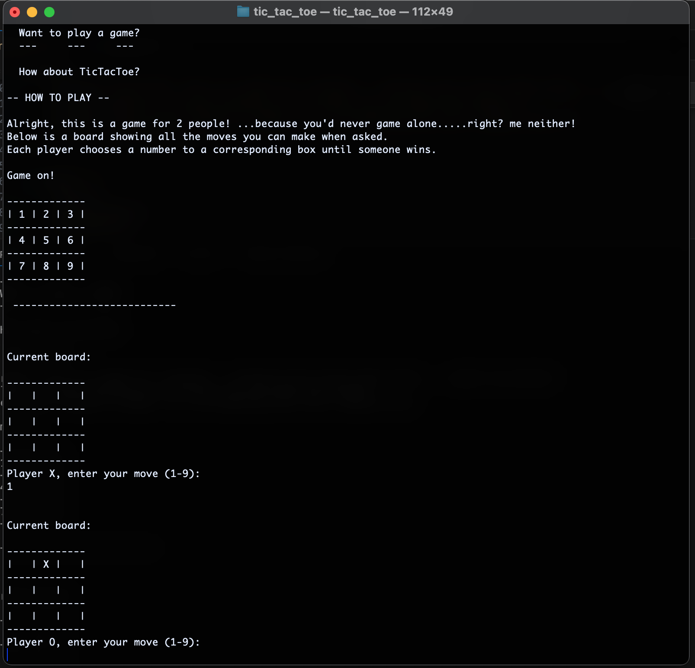

# Tic Tac Toe for Rustaceans! (Command Line Game)
_Note - This is a just dev project used for learning new technologies. 
        Not intended to for public use._

In order to run this app, run the following command from the root directory:

### `cargo run`

This runs the app as a command line program, like the good ol' days.

## Demo Screenshot:
_Here's a snippet of the game in action_ 

### _TODO:_
1. Look into some index bug with the player 2 entries
2. Create an AI to play as player 2
3. Handle Winner message better. Maybe have Ferris the Rustacean announce the winner..
4. Refactor main file. Explore different patterns with functions in other files. 
